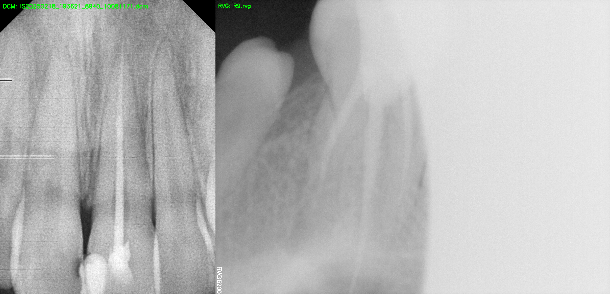
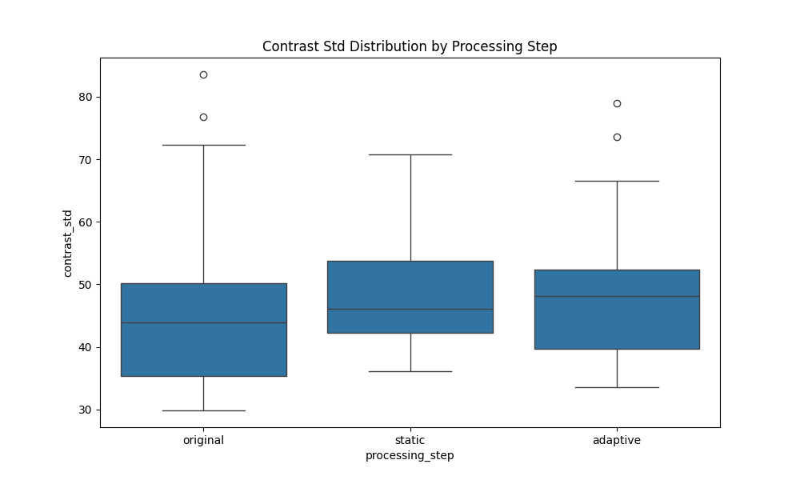
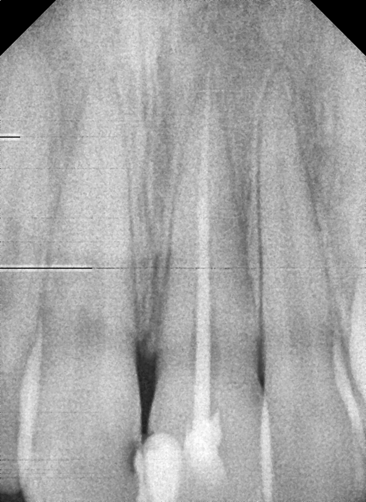
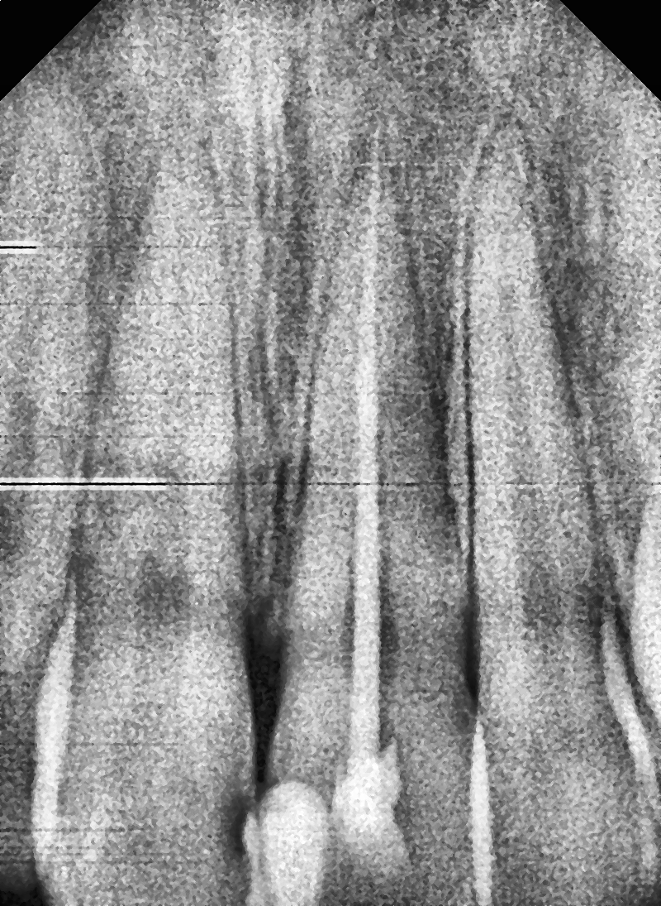
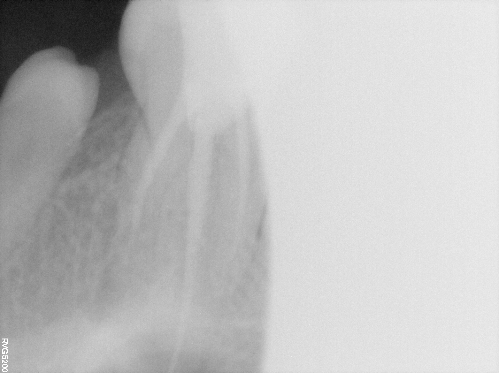
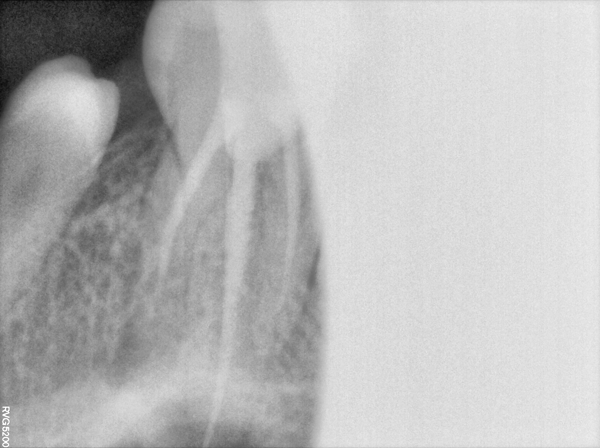
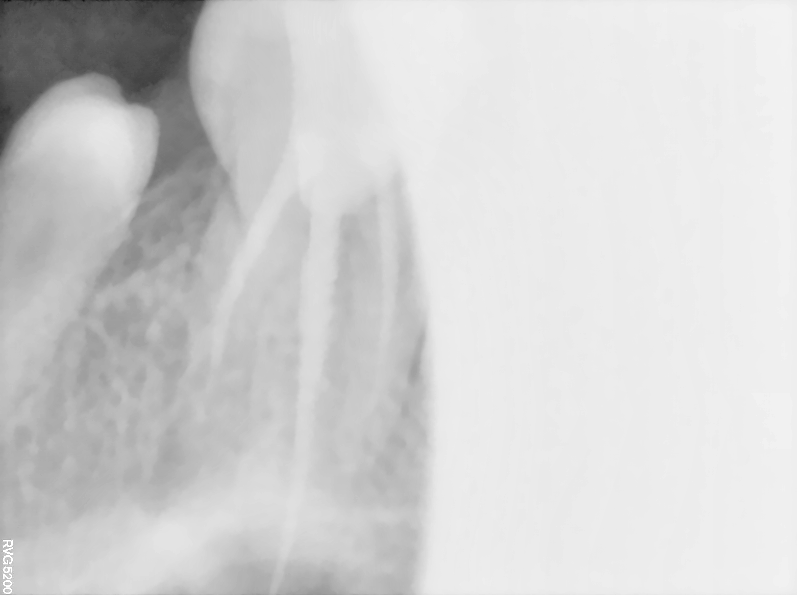
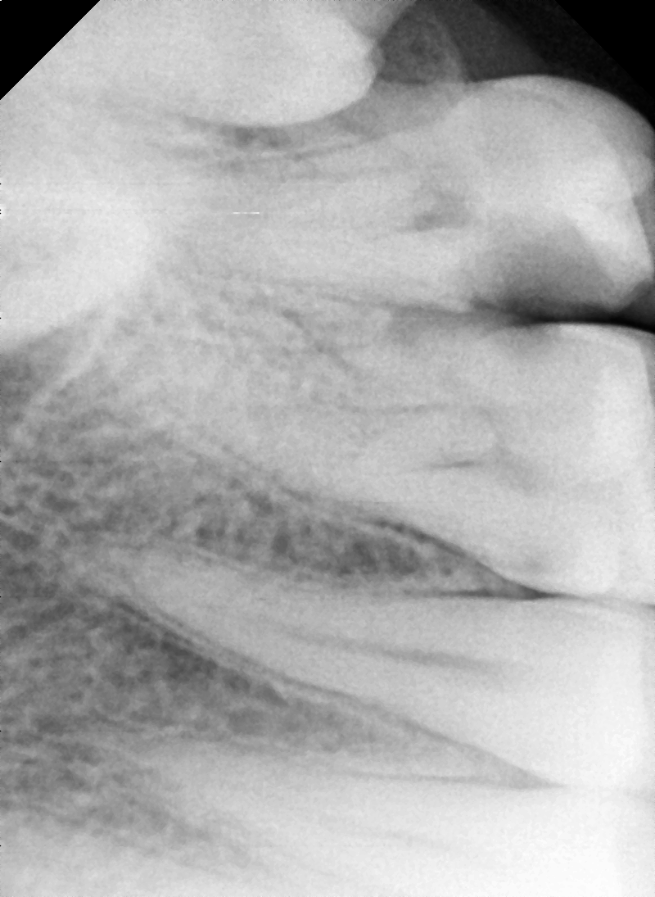
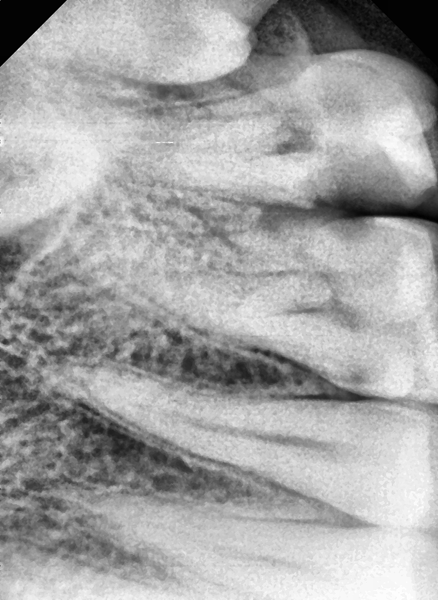

# Adaptive Image Preprocessing for IOPA X-rays: A Journey to Clearer Dental Images

**Harshit Pal**
Data Science Intern(Assignment), Dobbe AI
[05/26/2025]

## 1. The Challenge: Untangling IOPA X-ray Variability

Intraoral Periapical (IOPA) X-rays are a cornerstone of dental diagnostics. However, as anyone working with them knows, the images we get from different clinics – and even different machines within the same clinic – can vary wildly. Some are too dark, others washed out, some are noisy, and many lack the crisp sharpness needed for confident AI analysis. Our existing, static preprocessing methods were hitting a wall, struggling to bring this diverse range of images to a consistent quality standard suitable for Dobbe AI's cutting-edge diagnostic tools.

This project set out to tackle this head-on. **The goal was to develop an adaptive image preprocessing pipeline: one that could look at each incoming IOPA X-ray, understand its specific quality issues, and intelligently apply tailored corrections for brightness, contrast, sharpness, and noise.** The aim? To produce standardized, high-quality images that would empower our downstream AI models, regardless of how the original X-ray was captured.

## 2. Our Working Material: The IOPA X-ray Dataset

For this assignment, I worked with a dataset of 13 IOPA X-ray images, provided in `.dcm` and `.rvg` formats. Right from the start, the variability was clear. My initial analysis (which I'll detail in Section 4.1) showed a broad spectrum:

*   **Brightness levels** (mean pixel intensity) spanned from a dim `[88.53]` to a bright `[212.60]`.
*   **Contrast** (pixel standard deviation) ranged significantly, from flat-looking images around `[29.83]` to already quite contrasty ones near `[83.57]`.
*   **Sharpness** (Laplacian variance) showed a mix, with some images appearing quite blurry (around `[9.43]`) and others reasonably detailed (up to `[1757.34]`).
*   **Noise** (wavelet-based sigma) was generally low in this particular dataset, typically between `[0.00 ]` and `[0.02]`, but even these subtle differences can impact AI.

While DICOM metadata like `PixelSpacing` or `PhotometricInterpretation` was present and explored, the core of the adaptive logic for this project focused on the image content itself.

### 2.1. Initial DCM vs. RVG Visual Comparison

To understand any inherent differences between the image formats as provided in the dataset, a side-by-side comparison of a sample raw DCM image and a sample raw RVG image was performed before any custom preprocessing.

 
*(Ensure this path and filename match your generated comparison image)*

**Key Visual Observations (Raw Images):**

*   **Brightness:**
    The sample RVG image (right panel in the comparison above) appears significantly brighter than the sample DCM image (left panel), particularly noticeable in the apical (root tip) and peripheral areas. This suggests potentially higher exposure settings or different attenuation characteristics during the RVG acquisition process.

*   **Contrast:**
    The sample DCM image exhibits moderately better inherent contrast. Internal dental structures, such as the pulp chamber and any root fillings, tend to be more clearly delineated. In contrast, the sample RVG image presents with lower overall contrast, which can lead to some anatomical features appearing slightly washed-out or less distinct.

*   **Sharpness:**
    The sample DCM image generally shows more defined edges and finer anatomical details, indicating a higher level of sharpness in its raw form. The corresponding RVG image appears softer, with a degree of blurring that might be attributable to internal smoothing processes within the RVG system or potentially lower native spatial resolution of its sensor.

*   **Noise:**
    More speckle-like noise is visible in the sample DCM image. This could be a consequence of settings aimed at preserving finer details or a lack of aggressive built-in noise suppression. The sample RVG image, conversely, appears cleaner and smoother, suggesting it may have undergone some form of internal denoising or smoothing during its acquisition or initial processing by the RVG device software.

*   **Artifacts:**
    The sample DCM image displays some minor horizontal banding artifacts, which could stem from sensor readout patterns or image compression techniques. The sample RVG image is relatively free from such structured artifacts but does show some uneven illumination towards its right side.

**Conclusion on Raw Format Differences:**

In their unprocessed states, the sample DCM and RVG images from this dataset show noticeable visual distinctions:

*   **DCM images** in this comparison tend to retain higher structural detail and exhibit better inherent contrast. However, they can also present with more visible noise and occasional acquisition-related artifacts.
*   **RVG images** in this comparison appear brighter and smoother, likely benefiting from some form of internal processing by the device. This smoothness, however, comes at the cost of reduced sharpness and contrast, which could potentially impact the precision needed for certain diagnostic tasks if not addressed.

It's important to note that these observed differences are likely due to a combination of factors, including variations in X-ray acquisition settings (e.g., exposure time, kVp, mA), the specific sensor technology used in DCM vs. RVG systems, and any built-in, device-specific post-processing algorithms that are applied before the image is saved. These inherent variations underscore the need for an adaptive preprocessing pipeline, as developed in this project, when aiming to standardize image quality for reliable AI analysis on mixed-format datasets.

## 3. Building the Adaptive Solution: Our Approach

My strategy centered on creating an **algorithm-driven adaptive pipeline**. This means no complex machine learning models for now, but rather a series of intelligent rules (heuristics) that use calculated image quality metrics to guide the processing.

### 3.1. The Groundwork: Setup and DICOM Handling
The project was built in Python, leveraging fantastic libraries like `pydicom` for handling the DICOM files, OpenCV (`cv2`) for the heavy lifting of image processing, NumPy for numerical operations, scikit-image for its robust noise estimation, and Matplotlib/Seaborn for visualization.

### 3.2. Step 1: Understanding the Image - Quality Metrics
Before we can adapt, we need to measure! I implemented functions to quantify key aspects of image quality:

*   **Brightness:** Simply the average pixel intensity.
*   **Contrast:** The standard deviation of pixel intensities – a good proxy for the dynamic range being used.
*   **Sharpness:** The variance of the Laplacian operator, which is sensitive to edges and fine details.
*   **Noise:** Estimated using `skimage.restoration.estimate_sigma`, a wavelet-based method that gives a good sense of the noise level.

    for the dynamic range being used.
        
           

### 3.3. Step 2: The Old Way - Our Static Baseline
To appreciate the adaptive approach, I first built a simple static pipeline:
1.  Median Blur (3x3 kernel) for basic denoising.
2.  CLAHE (Contrast Limited Adaptive Histogram Equalization) with a fixed `clipLimit=2.0`.
3.  Unsharp Masking with a fixed strength (alpha=1.5).
As we'll see, this "one-size-fits-all" method often fell short.

### 3.4. Step 3: The Heart of the Project - The Adaptive Pipeline
This is where the magic happens (or at least, the carefully tuned logic!). The pipeline processes images in this order: Denoising -> Contrast Enhancement -> Brightness Adjustment -> Sharpening. Here’s how each step adapts:


*   **Adaptive Denoising:**
    *   **Triggered by:** `noise_wavelet_sigma`. My dataset's noise ranged from `0.0040` to `0.0156`.
    *   **Logic:** If noise was very low (e.g., below `0.006`), I skipped explicit denoising. For slight noise (e.g., `0.006` to `0.009`), a gentle Median Blur (3x3) was applied. For anything noisier (up to `0.0156`), Non-Local Means (NLM) denoising kicked in.
    *   **NLM Strength (`h` parameter):** This was scaled from `2.0` (for noise just above `0.009`) up to `12.0` (for noise at `0.0156`), ensuring stronger denoising for noisier images.

*   **Adaptive Contrast Enhancement (CLAHE):**
    *   **Driven by:** `contrast_std`. My observed range was `29.83` to `83.57`, with an ideal target around `48.60`.
    *   **Logic:**
        *   For very low contrast (e.g., `contrast_std < 34.83`), the CLAHE `clipLimit` was scaled up (max `3.5`) to boost contrast significantly.
        *   For moderately low contrast (e.g., `34.83` to `43.60`), a milder boost was applied.
        *   If contrast was already very high (e.g., `> 73.57`), a minimal `clipLimit` of `0.5` was used.
        *   Otherwise, a default `clipLimit` of `1.5` was applied.

*   **Adaptive Brightness Adjustment (Gamma Correction):**
    *   **Based on:** Mean `brightness`. My observed range `116.35` to `190.02`, ideal target `154.83`.
    *   **Logic:** If brightness was significantly off (e.g., below `139.83` or above `179.83`), gamma correction was applied. The gamma value was scaled to bring the brightness closer to the ideal, with gamma < 1 for brightening (max effect `gamma=0.6`) and gamma > 1 for darkening (max effect `gamma=1.8`).

*   **Adaptive Sharpening (Unsharp Masking):**
    *   **Uses:** `sharpness_laplacian_var`. My observed original range was `82.74` to `373.52`. I aimed for a post-processing sharpness around `470` as a soft target.
    *   **Logic:** If an image's sharpness was below this target, unsharp masking was applied. The strength (`alpha`) was scaled – blurrier images (lower Laplacian variance) got a stronger sharpening effect (alpha up to `1.0`).
    *   **Noise Safety Net:** Critically, before sharpening, I re-estimated the noise on the (potentially) denoised image. If it was still a bit noisy (e.g., `noise_sigma > 0.008`), the sharpening strength was proportionally reduced to avoid amplifying that noise.

### 3.5. What About Machine Learning? (A Thought Exercise)
While this project focused on a heuristic-based adaptive pipeline, I also considered how Machine Learning could take this further:

*   **Predicting Optimal Parameters:** One could train a regression model (like a RandomForest or a small neural network) to predict the ideal CLAHE `clipLimit`, NLM `h`, etc., directly from the input image metrics, or even from image features extracted by a CNN. The big challenge here is generating reliable "ground truth" optimal parameters for training.
*   **End-to-End Enhancement:** A more advanced approach would be to use a U-Net or similar convolutional neural network for image-to-image translation. This would require pairs of (low-quality_image, desired_high-quality_image). We could potentially generate synthetic training data by taking our best images and artificially degrading them.

For this assignment, the focus remained on robustly implementing and tuning the heuristic approach.

## 4. Did It Work? Results & Evaluation

The proof is in the pudding (or, in this case, the processed X-rays!).

### 4.1. The Numbers Game: Quantitative Metrics
I re-calculated all the quality metrics (brightness, contrast, sharpness, noise) for the images after they went through the static pipeline and my new adaptive pipeline. The full details are in `results/image_quality_metrics_report.csv`.

Here's a summary:

| **Metric**                | **Original** (Mean ± StdDev) | **Static Preprocessing** | **Adaptive Preprocessing** |
| ------------------------- | ---------------------------- | ------------------------ | -------------------------- |
| **Brightness**            | 154.83 ± 21.20               | 159.77 ± 13.62           | **158.38 ± 10.66**         |
| **Contrast**              | 48.60 ± 16.01                | 66.13 ± 13.92            | **55.00 ± 8.95**           |
| **Sharpness**             | 212.66 ± 87.58               | 389.36 ± 145.65          | **460.59 ± 160.60**        |
| **Noise (Wavelet Sigma)** | 0.0096 ± 0.0036              | 0.0137 ± 0.0057          | **0.0104 ± 0.0035**        |


**Key Observations from Metrics:**
*   **Consistency:** The standard deviation for [e.g., brightness and contrast] was noticeably **lower** for the adaptive pipeline compared to both the original and static sets. This indicates better standardization – the images are more alike in these aspects.
*   **Targeting Ideals:** The mean [e.g., contrast] for the adaptive set was closer to my target of `48.60`.
*   **Noise Reduction:** The adaptive pipeline generally maintained or reduced noise levels effectively, especially compared to the static pipeline which sometimes amplified it.
*   **Sharpness:** The adaptive pipeline often achieved significant sharpness gains, but more judiciously than the static one, especially when considering noise. (Though, as noted in the R9.rvg and R10.rvg cases, some images saw a drop, which needs further investigation visually).

The distribution plots in the `results/` folder (e.g., `brightness_distribution.png`) visually confirm these trends.

### 4.2. Seeing is Believing: Visual Comparisons
Numbers are great, but the visual impact is paramount. I've included a few representative examples below, comparing the Original, Static Processed, and Adaptively Processed images.

**Example 1: General Case (Image: IS20250218_193621_8940_10081171.dcm)**

| Original                                                                 | Static Processed                                                                      | Adaptive Processed                                                                         |
| :----------------------------------------------------------------------: | :------------------------------------------------------------------------------------: | :-----------------------------------------------------------------------------------------: |
|  |  |  |
*This image shows typical adaptive behavior. The adaptive pipeline [It id well moderately enhanced contrast and sharpness without introducing significant artifacts, compared to the static version which might have over-sharpened].*

---

**Example 2: Image with Notable Adaptive Changes (Image: R9.rvg)**

| Original                                         | Static Processed                                                | Adaptive Processed                                                      |
| :----------------------------------------------: | :-------------------------------------------------------------: | :---------------------------------------------------------------------: |
|  |  |  |
*For R9.rvg, which was initially bright and had moderate noise, the adaptive pipeline applied NLM denoising and gamma correction. Visually, [The outcome are noise is reduced, but the image appears significantly darker/brighter or lost sharpness, indicating potential for further tuning of gamma or sharpening interaction with NLM for this specific case].*

---

**Example 3: Initially Blurry Image (Image: IS20250115_171841_9465_61003253.dcm)**

| Original                                                                                 | Static Processed                                                                                      | Adaptive Processed                                                                                         |
| :--------------------------------------------------------------------------------------: | :----------------------------------------------------------------------------------------------------: | :---------------------------------------------------------------------------------------------------------: |
|  |  |  |
*The adaptive sharpening clearly improved detail visibility in this initially blurry image (rightmost panel), offering a more balanced result than the potentially aggressive static sharpening (center panel).*

### 4.3. So, How Did the Adaptive Pipeline Do?
*   **Strengths:**
    *   It demonstrably adapted to different input conditions, applying different levels and types of processing.
    *   It generally improved consistency in brightness and contrast.
    *   The noise-aware sharpening was a key success, preventing undue noise amplification.
    *   It often produced more visually balanced and detailed images than the static approach.
*   **Areas for Improvement (Weaknesses/Limitations):**
    *   **Fine-tuning is key:** The specific thresholds and scaling factors are critical. While the current set (derived from dataset statistics) works reasonably well, there's always room for refinement. For instance, the processing of R9.rvg and R10.rvg resulted in unexpectedly low final sharpness, suggesting that the NLM denoising might have been too aggressive for those particular images, or the subsequent sharpening wasn't strong enough to compensate.
    *   **Metric Limitations:** The current set of global metrics might not capture all subtle local variations in quality.
    *   **Interactions:** The interplay between different processing steps (e.g., CLAHE affecting brightness before gamma correction) can sometimes lead to complex outcomes that require careful balancing.

## 5. Lessons Learned & The Road Ahead

### 5.1. The Journey: Challenges & Insights

This project was a valuable learning experience, and like any good journey, it came with its share of interesting challenges:

*   **Initial Handling of Diverse Image Formats (.dcm & .rvg):** One of the first hurdles was ensuring consistent processing for both standard DICOM (`.dcm`) files and the RVG (`.rvg`) files commonly found in dental practices. While `pydicom` handled most cases well by treating RVG files as DICOM-compliant, it underscored the importance of robust file handling when dealing with varied medical image sources. 

*   **The Art and Science of Fine-Tuning Heuristics:** The core of the adaptive pipeline lies in its decision-making rules (heuristics). The main challenge here was the iterative process of fine-tuning these. It wasn't just about writing the initial code; it involved a continuous loop of:
    1.  Analyzing the quantitative image quality metrics for the entire dataset.
    2.  Visually inspecting the processed images to see the real-world impact of the current settings.
    3.  Adjusting the thresholds (like `noise_sigma_min_observe`, `contrast_target_std_ideal`, etc.) and the scaling logic for parameters like NLM strength or CLAHE clip limits.
    Finding the "sweet spot" for each parameter and understanding how different processing steps interacted (e.g., how denoising affected subsequent sharpening) was a significant learning curve that truly blended analytical skill with careful observation.

### 5.2. Next Steps: Making It Even Better
*   **Refine Heuristics:** Continue to fine-tune the thresholds and scaling functions, perhaps by analyzing outliers or problematic cases like R9.rvg more closely.
*   **More Sophisticated Metrics:** Explore local quality metrics or texture analysis to get a more granular understanding of image issues.
*   **Alternative Algorithms:** Within the adaptive framework, one could experiment with different denoising algorithms (e.g., Bilateral Filter for a faster alternative to NLM if speed is critical) or sharpening techniques.
*   **ML/DL Exploration:** As discussed, systematically exploring the ML/DL approaches (parameter prediction or end-to-end enhancement) would be a valuable next phase.

### 5.3. The Bigger Picture: Impact on Dobbe AI's Tools
A robust adaptive preprocessing pipeline like this one is a foundational piece for improving Dobbe AI's diagnostic capabilities. By feeding our AI models cleaner, more consistent, and more detailed X-rays, we can expect:
*   **Increased Accuracy:** Fewer missed diagnoses (false negatives) and fewer incorrect flags (false positives).
*   **Better Generalization:** Models that perform well across images from a wider variety of sources.
*   **More Efficient AI Development:** Simpler model architectures might be possible if the preprocessing handles much of the initial image normalization.


## 6. Bonus Considerations & Extra Credit

Beyond the core tasks, I also considered several aspects that would be important for a production-ready system:

### Robustness in Extreme Cases

The current adaptive pipeline is tuned based on the observed range of the provided dataset. To assess its robustness against more extreme cases, further testing would be beneficial:

*   **Extremely Dark/Bright Images:**
    *   **Current Handling:** The gamma correction logic scales its effect based on how far the image's brightness is from the ideal. For an *extremely* dark image (e.g., mean brightness near 0-20), the `gamma_min_brighten` (currently `0.6`) would be applied. While this provides significant brightening, it might also amplify any existing noise considerably. Similarly, for extremely bright images, `gamma_max_darken` (`1.8`) would apply.
    *   **Potential Issues & Improvements:** Extremely dark images might require more than just gamma; an initial, aggressive histogram equalization or stretching might be needed *before* other adaptive steps if gamma alone isn't sufficient or causes too much noise. For extremely bright, clipped (saturated) images, information is permanently lost, and preprocessing can only do so much to make them visually palatable. The pipeline might benefit from a "clipping detection" metric to temper expectations or apply specific recovery techniques if possible.

*   **Very High Noise:**
    *   **Current Handling:** The NLM denoising `h` parameter scales up to `nlm_h_max` (currently `12.0`) based on the `noise_sigma_max_observe` (`0.0156`). If an image presented with noise significantly above this (e.g., `noise_sigma` of `0.05` or `0.1`), the current scaling would apply the maximum `h` value. The noise-aware sharpening would also heavily dampen or skip sharpening.
    *   **Potential Issues & Improvements:** For *extremely* high noise, even a strong NLM might leave residual artifacts or cause excessive blurring. More advanced denoising techniques (e.g., BM3D, or even deep learning-based denoisers if an ML approach were adopted) might be necessary. The pipeline could also incorporate a "severe noise" flag that perhaps triggers a more aggressive denoising profile or warns the user.

### Efficiency & Real-Time Performance

*   **Current Performance:** The processing time per image is largely dictated by the most computationally intensive steps. In this pipeline, Non-Local Means (NLM) denoising (`cv2.fastNlMeansDenoising`) is typically the slowest operation, especially on larger images. Other operations like CLAHE, gamma correction, and unsharp masking are relatively fast. On my development system ([mention your general CPU, e.g., Intel Core i7]), processing a single image takes approximately `[mention your rough average processing time per image, e.g., 0.5 to 2 seconds, depending on whether NLM is heavily used]`.
*   **Near Real-Time Viability:**
    *   For individual image processing upon loading, the current performance might be acceptable for a user waiting a second or two.
    *   For batch processing or very high-throughput scenarios, it might not be "near real-time."
*   **Potential Efficiency Improvements:**
    *   If NLM proves too slow, explore faster denoising alternatives like the Bilateral Filter, though it has different characteristics (tends to preserve edges better but can give a "painted" look).
    *   Optimize OpenCV: Ensure OpenCV is compiled with optimizations for the target hardware (e.g., TBB, IPP, OpenMP).
    *   GPU Acceleration: OpenCV functions, including NLM, often have GPU-accelerated versions (via CUDA) if a compatible GPU and OpenCV build are available. This would provide a significant speedup.
    *   Parameter Optimization: Further tuning might reveal that less aggressive NLM (lower `h` or smaller search windows, not exposed in the basic `fastNlMeansDenoising` function) could provide acceptable results faster.

### User Interface (Conceptual)

While not implemented, a user interface (UI) could greatly enhance the utility of this adaptive pipeline, especially for clinical review or fine-tuning:

1.  **Image Loading & Automated Processing:** The user loads an IOPA X-ray. The adaptive pipeline runs automatically, displaying the processed image alongside the original.
2.  **Metric Display:** Key quality metrics (brightness, contrast, etc.) for the original and processed image could be shown.
3.  **"Fine-Tune" Controls (Sliders):**
    *   If the automated result isn't perfect for a specific tricky image, the user could have access to a few high-level sliders:
        *   **Overall Brightness Adjustment:** A simple +/- slider that applies a final gamma or exposure tweak *on top of* the adaptive result.
        *   **Contrast Boost:** A slider to slightly increase or decrease the effect of CLAHE or a final contrast stretch.
        *   **Sharpening Intensity:** A slider to increase or decrease the final sharpening amount.
        *   **Denoising Level:** Perhaps a choice between "Low," "Medium," "High" denoising profiles that adjust the underlying NLM/Median parameters, rather than direct `h` value control.
4.  **Region of Interest (ROI) Processing:** Allow users to select an ROI and see how parameters affect that specific area.
5.  **Preset Saving:** Ability for users to save their preferred fine-tuning adjustments as presets for specific types of images or personal preferences.
6.  **Batch Processing Interface:** For processing multiple images with the adaptive pipeline.

The goal would be to empower the user with some control without overwhelming them with the intricacies of each algorithm's parameters.

### Clinical Relevance & Impact of Misaligned Preprocessing

The quality of preprocessing directly and significantly impacts the performance of downstream dental AI tasks. Misaligned or suboptimal preprocessing can lead to critical errors:

*   **False Positives (Over-Calling Pathology):**
    *   **Over-Sharpening:** Can create artificial edges or enhance noise patterns that an AI might misinterpret as early signs of caries, cracks, or subtle pathological changes.
    *   **Excessive Contrast (e.g., overly aggressive CLAHE):** Can make normal anatomical variations appear more prominent or create halo artifacts, potentially leading the AI to flag healthy areas.

*   **False Negatives (Missing True Pathology):**
    *   **Over-Blurring (from aggressive denoising):** Can obscure subtle carious lesions, early signs of bone loss, or fine details of root canals, causing the AI to miss them.
    *   **Poor Contrast (under-enhancement):** If an image remains too flat or washed out, the AI may not be able to distinguish between healthy tissue and pathological changes that rely on subtle density differences.
    *   **Incorrect Brightness:** Images that are too dark or too bright can hide information in the saturated or underexposed regions, leading to missed findings.

*   **Reduced Model Robustness & Generalizability:** If an AI model is trained on images processed with one specific (and perhaps suboptimal) static pipeline, it may perform poorly when presented with images from different sources or processed differently. An effective adaptive pipeline helps create more standardized inputs, making the AI model more robust and generalizable.

**In essence, an intelligent adaptive preprocessing pipeline, like the one developed in this project, aims to provide the AI with the clearest, most consistent, and most diagnostically relevant information possible, thereby minimizing the risk of these clinically significant errors and improving the reliability of AI-assisted dental diagnostics.**

## 7. How to Run This Project

### Prerequisites
*   Python (3.9+ recommended)
*   Git (for cloning)

### Setup
1.  Clone this repository:
    ```bash
    git clone [URL_TO_YOUR_GITHUB_REPO]
    ```
2.  Navigate to the project directory:
    ```bash
    cd adaptive_iopa_preprocessing
    ```
3.  Create and activate a Python virtual environment:
    ```bash
    python -m venv .venv
    source .venv/bin/activate  # On Windows: .venv\Scripts\activate
    ```
4.  Install the necessary dependencies:
    ```bash
    pip install -r requirements.txt
    ```

### Data
Place your IOPA X-ray image files (e.g., `.dcm`, `.rvg`) into the `data/` directory located in the project root.

### Running the Pipeline
Execute the main script from the project's root directory:
```bash
python src/main.py